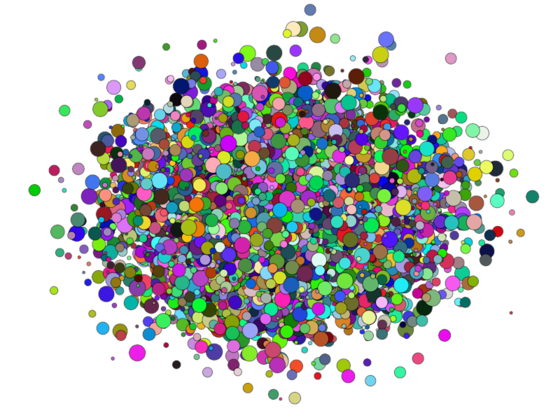
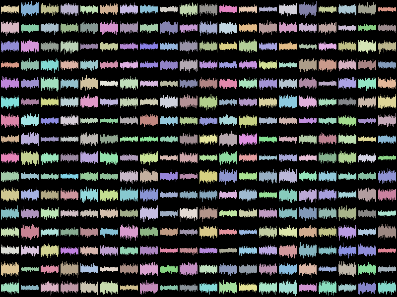
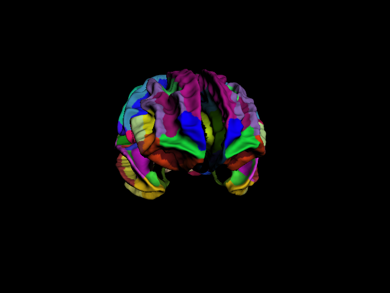

# Big Data Visualization with WebGL: from Python to JavaScript

Proposal for the [WebGL Insights](http://www.webglinsights.com/) community book.

## Authors

* [Cyrille Rossant](http://cyrille.rossant.net/) (University College London)
* [Almar Klein](http://www.almarklein.org/) (Cinoptics)
* [Luke Campagnola](http://luke.campagnola.me) (University of North Carolina at Chapel Hill)
* [Eric Larson](http://staff.washington.edu/larsoner/) (University of Washington)
* [Kenneth D. Harris](https://iris.ucl.ac.uk/iris/browse/profile?upi=KDHAR02) (University College London)
* [Nicolas Rougier](http://www.loria.fr/~rougier/) (INRIA)

## Abstract

The deluge of data arising in many disciplines calls for modern, innovative analysis methods. Whereas more and more processes can be automated, human supervision is nevertheless often required at most stages of the analysis pipelines. The primary way humans can apprehend data for explorative analysis is visualization. Effective big data visualization methods have to be *interactive*, *fast*, and *scalable*.

Modern datasets may be large and high-dimensional, thus no static two-dimensional image can possibly convey all relevant information. A common technique is to create *interactive* visualizations, where the user can explore the various dimensions and subsets of the data. For such data exploration to be most effective, the rendering framerate need to be optimal even with very large datasets. Finally, big data visualization methods need to support distributed and remote technologies in order to scale to huge datasets stored in cloud architectures.

We developed specific rendering techniques with OpenGL ES 2.0 to leverage the computational power of graphics hardware for interactive big data visualization [Rossant and Harris, 2013]. We implemented these techniques in a Python library called Vispy [Klein et al., 2014]. Python is one of the leading open source platforms for data analysis and numerical computing [Oliphant, 2007]. Whereas there are many visualization and plotting libraries in Python, Vispy is one of the first libraries that lets scientists visualize millions of data points interactively at an optimal framerate. Vispy supports many types of datasets: scatter plots, digital signals, images, 3D models, and many others. Vispy focuses on high performance, scalability to datasets containing millions of points, and high quality through a GLSL implementation of Antigrain Geometry [Shemanarev]. Its flexible and layered architecture allows for the creation of custom visuals and rendering techniques like volume rendering or ray tracing. Vispy notably features an object-oriented interface to OpenGL that considerably simplifies the standard OpenGL API for the most common use-cases.

Whereas Python is an excellent platform for data analysis, it lags behind the Web browser when it comes to remote visualization and sharing of interactive analysis reports. The need for remote data access is all the more critical that the size of common datasets increases faster than transfer speeds. Therefore, it is common practice for large datasets to be stored in the cloud, while analysts visualize the data remotely through the Web browser on a desktop or mobile device.

In this chapter, we will present the different techniques we have been developing in order to integrate our OpenGL-based Python library into the Web browser. The main challenge is to let scientists visualize their data without the need to write JavaScript. Most scientists do not have a formal training in programming, and they would be unwilling to learn an additional language beyond Python. Therefore, we are aiming for an automatic and transparent Web backend for Vispy. We have defined three methods, which are each expected to be useful in different use-cases.

The first approach consists of letting the server render the scene locally and send the raster images to the browser in real-time. This technique may be useful on low-end clients or situations where the data being visualized is very large.

In the second approach, the server emits OpenGL command calls that are proxied to the Web browser. The browser renders the scene by executing these commands through WebGL. This method may involve transfers of significant volumes of data. However, most of our visualization techniques involve GPU data transfers at initialization time only. This is the main and most useful approach.

In the third approach, the server exports an entire visualization to a standalone interactive HTML/JavaScript/WebGL document. This method is restricted to relatively simple cases. However, users familiar with JavaScript can extend the exported document through a simple API. This approach is useful when an interactive visualization is needed in absence of a Python server.

The last two approaches feature GLIR (OpenGL Intermediate Representation), a new intermediate-level representation of all OpenGL constructs we need in Vispy. A static visualization in this representation is described by a linear sequence of commands that instruct the interpreter to create buffers, define OpenGL programs, and draw the scene. This level of abstraction matches Vispy's object-oriented interface to OpenGL. We needed to define this new representation because the regular OpenGL API was too low-level for our needs. In particular, GLIR commands do not return any values, which makes it possible to evaluate them asynchronously.

For interactivity, we developed a combination of Python-to-JavaScript code translation utilities, JavaScript numerical computing libraries, and high-level interactive constructs in order to export a reactive visualization from Python to JavaScript.

## Screenshots

Scatter plot with point sprites:

Multiple signals displayed efficiently with a single OpenGL API call (placement computed in the vertex shader, clipping in the fragment shader):
    

A 3D model of a brain:

More examples can be found [in the gallery](http://vispy.org/gallery.html).

## References

* [Almar Klein et al. (2014). Vispy 0.3.0. ZENODO.](http://zenodo.org/record/11532#.VDPf2HV_upc)
* Oliphant, T. E. (2007). Python for scientific computing. Computing in Science & Engineering, 9(3), 10-20.
* Rossant, C., & Harris, K. D. (2013). [Hardware-accelerated interactive data visualization for neuroscience in Python](http://journal.frontiersin.org/Journal/10.3389/fninf.2013.00036/full). Frontiers in neuroinformatics, 7.
* Shemanarev, M. [The anti-grain geometry project](http://www.antigrain.com/).
